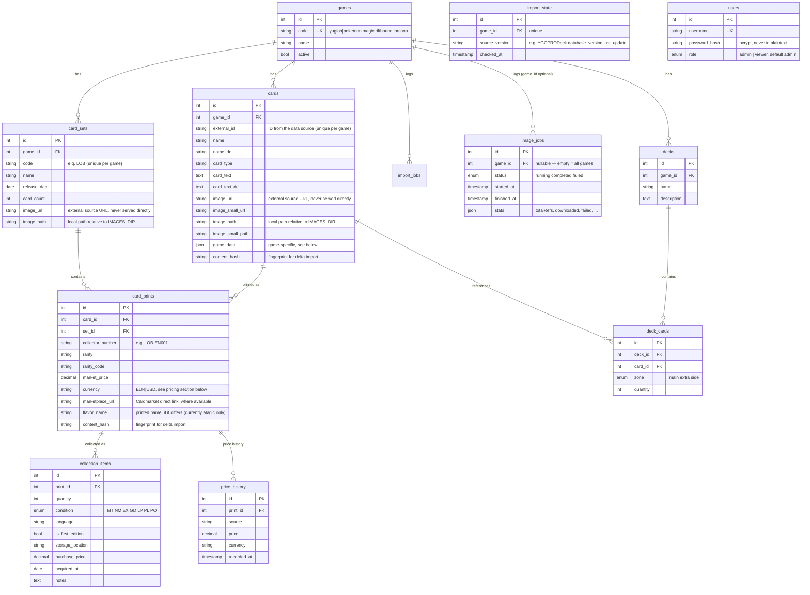

# Database

*[Deutsche Version](DATENBANK.md)*

MariaDB schema `tcg_collection`, managed via **Knex migrations** (`backend/migrations/`).
Never change tables by hand — always create a new migration (`npx knex migrate:make <name>`).

## Multi-TCG core idea

The schema separates three layers that work identically for **all** trading card games:

1. **Card** (`cards`) — the logical card ("Blue-Eyes White Dragon"), independent of where it was printed.
2. **Print** (`card_prints`) — a specific printing of that card in a set with a set number and rarity ("LOB-EN001, Ultra Rare" — the sources consistently only provide the English reference code, even for cards with a German TCG release; the card search therefore treats the language abbreviation as a wildcard, see `backend/src/services/cardNumbers.ts`). A card often has many prints.
3. **Collection entry** (`collection_items`) — physically owned copies of a print, with quantity, condition, language, 1st edition flag, storage location, purchase price.

So what gets collected is always a **print**, never the abstract card — exactly as in cardcluster.

Game-specific attributes (ATK/DEF/Level/Attribute for Yu-Gi-Oh!, mana cost/colors for Magic, Ink/Strength/Willpower for Lorcana, HP/Type for Pokémon, Energy/Might/Domain for Riftbound, …) live as JSON in `cards.game_data` (details per game further below). This means a new game requires **no schema change**, just a new importer.

## ER diagram



`users` is deliberately kept **without a relationship** to the other tables — the collection is (still) not split per user; the login currently only protects access to the app as a whole (relevant as soon as it's reachable from outside the LAN). Accounts are not created via the API but via CLI (`npm run user:create -- <username> <password>`, see [docs/DEPLOYMENT-SYNOLOGY.en.md](DEPLOYMENT-SYNOLOGY.en.md)).

## Delta import (`content_hash`, `import_state`)

A repeated catalog import doesn't reload everything on every run:

1. **Version short-circuit**: Before the actual sync, the current version of the source is queried (for YGOPRODeck via `checkDBVer.php`) and compared with the last-seen value in `import_state.source_version`. If it's identical, the import aborts immediately — no further API request, no DB write.
2. **Content comparison**: If the source version has changed (or on the very first import), only what has actually changed is written: for every card/print, an MD5 fingerprint of the relevant fields is computed and compared against the value stored in `cards.content_hash`/`card_prints.content_hash`. A write only happens on a mismatch (new or changed record).

This keeps both the number of API calls and the number of DB writes minimal when the data hasn't changed — important for regular automated runs (see `npm run import:delta` and [docs/DEPLOYMENT-SYNOLOGY.en.md](DEPLOYMENT-SYNOLOGY.en.md)).

A new importer for another game should adopt the same principle, but isn't strictly required to — `ImportOptions.force` and the `skipped`/`*Changed` fields in `ImportStats` are part of the `GameImporter` interface and are already supported generically by routes/scripts.

## Contents of `cards.game_data` per game

Each importer fills `game_data` with its own game-specific fields (details in `backend/src/services/importers/<game>.ts`) — the filter UI reads these fields generically via `backend/src/services/gameConfig.ts`, so a new field requires **no** schema change.

**Yu-Gi-Oh!** (YGOPRODeck importer):
```json
{
  "frameType": "effect",
  "race": "Dragon",
  "attribute": "LIGHT",
  "level": 8,
  "atk": 3000,
  "def": 2500,
  "archetype": "Blue-Eyes",
  "linkval": null,
  "scale": null,
  "banTcg": null
}
```

**Magic: The Gathering** (Scryfall importer):
```json
{ "colors": "UB", "cmc": 4, "mana_cost": "{2}{U}{B}" }
```
(`colors` is a concatenated string, e.g. `"C"` for colorless; `cmc` = Converted Mana Cost.)

**Pokémon TCG** (pokemontcg.io importer):
```json
{ "type": "Water", "types": "Water", "subtypes": "Basic", "hp": 70, "evolvesFrom": null, "rarity": "Common" }
```

**Disney Lorcana** (lorcanajson.org importer):
```json
{ "ink": "Amber", "cost": 3, "lore": 2, "strength": 2, "willpower": 3, "inkwell": true, "rarity": "Common", "story": "..." }
```

**Riftbound** (riftcodex.com importer):
```json
{ "energy": 2, "might": 4, "power": null, "domain": ["Fury"], "supertype": "Champion", "rarity": "Rare", "tags": [...], "artist": "...", "flavour": "...", "riftbound_id": "unl-116a-219" }
```

## German localization (`name_de`, `card_text_de`)

Populated differently per game; the frontend always automatically displays `name_de || name` and `card_text_de || card_text` — no separate per-game language switch is needed:

- **Yu-Gi-Oh!**: In addition to the English catalog, the importer also loads the German catalog from YGOPRODeck (`cardinfo.php?language=de`). Not every card has a German TCG release (as of the first import: 11,769 of 14,472 cards) — in that case both fields stay `null`.
- **Disney Lorcana**: lorcanajson.org delivers DE and EN together in one go, no gaps expected.
- **Riftbound**: The API (riftcodex.com) only delivers English — a custom translation file `backend/src/data/riftbound.de.json` (989 cards translated by Claude, **not** the official Riot localizations). Icon placeholders and keywords in square brackets (`[Deflect]` etc.) remain untranslated.
- **Magic, Pokémon**: no German text — for Magic this would require Scryfall's significantly larger `all_cards` bulk file (2.5 GB instead of 557 MB); for Pokémon the source fundamentally only delivers English.

## Prices, currency, and marketplace links (`card_prints.market_price`/`currency`/`marketplace_url`)

`market_price` is **not** uniformly in one currency — `currency` (since 2026-07-21, migration `20260721000002_print_currency.js`) states which one:

| Game | Source | Currency | Granularity |
|---|---|---|---|
| Yu-Gi-Oh! | YGOPRODeck `card_sets[].set_price` (TCGPlayer) | **USD** | per print/rarity |
| Magic | Scryfall `prices.eur` (itself sourced from Cardmarket) | EUR | per print/rarity |
| Pokémon | pokemontcg.io `cardmarket.prices.trendPrice` | EUR | per print/rarity |
| Lorcana | `dotgg.gg` API `cmPrice` (fallback: no price) | EUR | per print/rarity |
| Riftbound | `dotgg.gg` API `cmPrice` (fallback: no price) | EUR | per print/rarity |

**Why Yu-Gi-Oh! is USD instead of EUR**: YGOPRODeck does provide a real Cardmarket EUR price as well (`card_prices[0].cardmarket_price`), but only **once per card**, not per print/rarity — a Common and a Secret Rare of the same card would then have the same price, which distorts collection values. This trade-off was deliberately rejected (user decision, see `PROGRESS.md` 2026-07-21), sticking with USD with correct rarity granularity instead of being granular but mislabeled.

**Exchange rate conversion**: Any aggregation across multiple prints (`GET /collection/stats` → `marketValue`, `GET /collection?sort=value`) would otherwise simply add/compare USD and EUR amounts as if they were equal. `backend/src/services/exchangeRate.ts` fetches the current USD→EUR rate for this from the free, keyless ECB reference rate API `api.frankfurter.app` (cached for 12h, with a hard fallback rate if unreachable) and converts USD prints before summation. Individual prices (card/set detail page, price history chart) remain unchanged in their native currency — only cross-game sums/sorts get converted.

**`marketplace_url`**: a ready-made direct link to the Cardmarket product page, where the source provides one (Lorcana additionally via lorcanajson.org's `externalLinks.cardmarketUrl`, otherwise/as fallback via the same `dotgg.gg` API as the prices). The frontend shows a "↗" icon next to the price when a link is present.

`dotgg.gg` (base URL `api.dotgg.gg`, endpoint `/cgfw/getcards?game=<game>`) is a free, publicly documented REST API (`dotgg.gg/api/`, no key) of the `DotGG` network (which also runs, among others, Lorcana.gg, "Pokémon TCG Zone", "Yu-Gi-Oh! Zone") — deliberately treated only as a supplementary source (best-effort, returns an empty map on errors instead of blocking the import), since it is documented "as-is" without an uptime guarantee.

## Printed name on crossover sets (`card_prints.flavor_name`, since 2026-07-31)

Magic crossover sets ("Universes Beyond", e.g. "Final Fantasy: Through the Ages", Warhammer 40,000, Lord of the Rings, Marvel, Secret Lair) sometimes print a theme-appropriate name on the physical card instead of the actual rules-text card name (Scryfall field `flavor_name`) — e.g. the physical card "The Cloudsea Djinn" (Final Fantasy: Through the Ages, #16) actually carries the rules text of "Nyxbloom Ancient". Found because exactly this case wasn't findable in the catalog: the import only knew `cards.name`. Deliberately stored on the **print** (not the card), since the same real card name can carry a different or no flavor name depending on the print. Only the Magic importer populates this field so far (`backend/src/services/importers/magic.ts`); card search (`GET /games/:code/cards?search=`) and the print tables in the frontend (set/card detail page, collection) take it into account alongside the real name.

## Condition scale (`collection_items.condition`)

Cardmarket standard: `MT` Mint · `NM` Near Mint · `EX` Excellent · `GD` Good · `LP` Light Played · `PL` Played · `PO` Poor.

## Setting up the database on the Synology

One-time, in phpMyAdmin or via CLI as root:

```sql
CREATE DATABASE tcg_collection CHARACTER SET utf8mb4 COLLATE utf8mb4_unicode_ci;
CREATE USER 'tcg'@'%' IDENTIFIED BY '<secure-password>';
GRANT ALL PRIVILEGES ON tcg_collection.* TO 'tcg'@'%';
FLUSH PRIVILEGES;
```

Then enter the credentials in `.env` and run the migration:

```bash
cd backend && npm run migrate
```

The migration creates all tables and inserts the five games into `games` (`yugioh` active from the start, the other four initially inactive — each game activates itself automatically after its first successful catalog import via the corresponding dashboard button).
