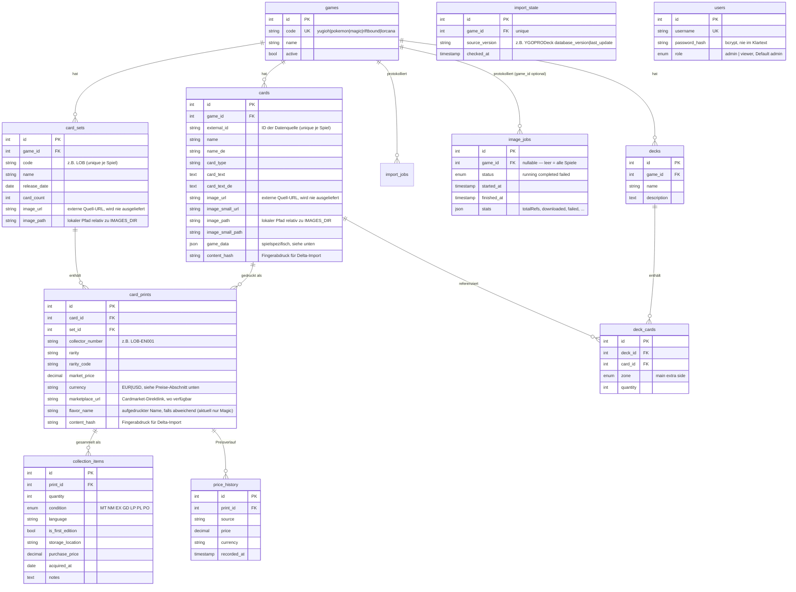

# Datenbank

*[English version](DATENBANK.en.md)*

MariaDB-Schema `tcg_collection`, verwaltet über **Knex-Migrationen** (`backend/migrations/`).
Niemals Tabellen von Hand ändern — immer eine neue Migration anlegen (`npx knex migrate:make <name>`).

## Multi-TCG-Grundidee

Das Schema trennt drei Ebenen, die für **alle** Sammelkartenspiele identisch funktionieren:

1. **Karte** (`cards`) — die logische Karte („Blauäugiger w. Drache"), unabhängig davon, wo sie gedruckt wurde.
2. **Print** (`card_prints`) — ein konkreter Druck dieser Karte in einem Set mit Set-Nummer und Seltenheit („LOB-EN001, Ultra Rare" — die Quellen liefern durchgehend nur den englischen Referenz-Code, auch für Karten mit deutscher TCG-Ausgabe; die Kartensuche behandelt das Sprachkürzel deshalb als Wildcard, siehe `backend/src/services/cardNumbers.ts`). Eine Karte hat oft viele Prints.
3. **Sammlungseintrag** (`collection_items`) — physisch besessene Exemplare eines Prints mit Menge, Zustand, Sprache, 1. Auflage, Lagerort, Kaufpreis.

Gesammelt wird also immer ein **Print**, nicht die abstrakte Karte — genau wie bei cardcluster.

Spielspezifische Attribute (ATK/DEF/Level/Attribut bei Yu-Gi-Oh!, Manakosten/Farben bei Magic, Ink/Stärke/Willenskraft bei Lorcana, HP/Typ bei Pokémon, Energy/Might/Domäne bei Riftbound, …) liegen als JSON in `cards.game_data` (Details je Spiel weiter unten). Dadurch braucht ein neues Spiel **keine Schemaänderung**, nur einen neuen Importer.

## ER-Diagramm



`users` steht bewusst **ohne Beziehung** zu den anderen Tabellen — die Sammlung ist (noch) nicht pro Nutzer getrennt, der Login schützt aktuell nur den Zugriff auf die App als Ganzes (relevant, sobald sie außerhalb des LAN erreichbar ist). Accounts werden nicht über die API angelegt, sondern per CLI (`npm run user:create -- <username> <passwort>`, siehe [docs/DEPLOYMENT-SYNOLOGY.md](DEPLOYMENT-SYNOLOGY.md)).

## Delta-Import (`content_hash`, `import_state`)

Ein erneuter Katalog-Import lädt nicht bei jedem Lauf alles neu:

1. **Versions-Kurzschluss**: Vor dem eigentlichen Abgleich wird die aktuelle Version der Quelle abgefragt (bei YGOPRODeck über `checkDBVer.php`) und mit dem zuletzt gesehenen Wert in `import_state.source_version` verglichen. Ist sie identisch, bricht der Import sofort ab — keine weitere API-Anfrage, kein DB-Schreibzugriff.
2. **Inhalts-Vergleich**: Hat sich die Quellversion geändert (oder beim allerersten Import), wird trotzdem nur geschrieben, was sich wirklich geändert hat: Für jede Karte/jeden Print wird ein MD5-Fingerabdruck der relevanten Felder berechnet und mit dem in `cards.content_hash`/`card_prints.content_hash` gespeicherten Wert verglichen. Nur bei Abweichung (neuer oder geänderter Datensatz) erfolgt ein Schreibzugriff.

Das hält sowohl die Anzahl der API-Aufrufe als auch die Zahl der DB-Schreibvorgänge bei unveränderten Daten minimal — wichtig für regelmäßige automatische Läufe (siehe `npm run import:delta` bzw. [docs/DEPLOYMENT-SYNOLOGY.md](DEPLOYMENT-SYNOLOGY.md)).

Ein neuer Importer für ein weiteres Spiel sollte dasselbe Prinzip übernehmen, muss es aber nicht zwingend — `ImportOptions.force` und die `skipped`/`*Changed`-Felder in `ImportStats` sind Teil des `GameImporter`-Interfaces und werden von Routen/Scripts bereits generisch unterstützt.

## Inhalt von `cards.game_data` je Spiel

Jeder Importer befüllt `game_data` mit seinen eigenen, spielspezifischen Feldern (Details siehe `backend/src/services/importers/<spiel>.ts`) — die Filter-UI liest diese Felder generisch über `backend/src/services/gameConfig.ts`, ein neues Feld braucht also **keine** Schemaänderung.

**Yu-Gi-Oh!** (YGOPRODeck-Importer):
```json
{
  "frameType": "effect",
  "race": "Dragon",
  "attribute": "LIGHT",
  "level": 8,
  "atk": 3000,
  "def": 2500,
  "archetype": "Blue-Eyes",
  "linkval": null,
  "scale": null,
  "banTcg": null
}
```

**Magic: The Gathering** (Scryfall-Importer):
```json
{ "colors": "UB", "cmc": 4, "mana_cost": "{2}{U}{B}" }
```
(`colors` ist ein zusammengezogener String, z. B. `"C"` für farblos; `cmc` = Converted Mana Cost.)

**Pokémon TCG** (pokemontcg.io-Importer):
```json
{ "type": "Water", "types": "Water", "subtypes": "Basic", "hp": 70, "evolvesFrom": null, "rarity": "Common" }
```

**Disney Lorcana** (lorcanajson.org-Importer):
```json
{ "ink": "Amber", "cost": 3, "lore": 2, "strength": 2, "willpower": 3, "inkwell": true, "rarity": "Common", "story": "..." }
```

**Riftbound** (riftcodex.com-Importer):
```json
{ "energy": 2, "might": 4, "power": null, "domain": ["Fury"], "supertype": "Champion", "rarity": "Rare", "tags": [...], "artist": "...", "flavour": "...", "riftbound_id": "unl-116a-219" }
```

## Deutsche Lokalisierung (`name_de`, `card_text_de`)

Je Spiel unterschiedlich befüllt, Frontend zeigt in allen Fällen automatisch `name_de || name` bzw. `card_text_de || card_text` an — keine gesonderte Sprachumschaltung pro Spiel nötig:

- **Yu-Gi-Oh!**: Importer lädt zusätzlich zum englischen Katalog den deutschen Katalog von YGOPRODeck (`cardinfo.php?language=de`, Primärquelle). Nicht jede Karte hat dort eine deutsche TCG-Ausgabe (Stand des ersten Imports: 11.769 von 14.472 Karten) — dann bleiben beide Felder zunächst `null`. Für genau diese Lücken fragt der Importer bei `--force`-Läufen zusätzlich **Yugipedia** als Sekundärquelle ab (`backend/src/services/importers/yugipedia.ts`) — Details im eigenen Abschnitt unten.
- **Disney Lorcana**: lorcanajson.org liefert DE und EN direkt in einem Rutsch, keine Lücken zu erwarten.
- **Riftbound**: Die API (riftcodex.com) liefert nur Englisch — eigene Übersetzungsdatei `backend/src/data/riftbound.de.json` (989 von Claude übersetzte Karten, **nicht** die offiziellen Riot-Lokalisierungen). Icon-Platzhalter und Schlüsselwörter in eckigen Klammern (`[Deflect]` etc.) bleiben unübersetzt.
- **Magic**: seit 2026-08-01 ebenfalls befüllt. Importer streamt jetzt Scryfalls `all_cards`-Bulk-Datei statt der kleineren `default_cards` (372 statt 74 MB komprimiert) — nur `all_cards` enthält auch die deutschen Papier-Ausgaben (`lang: "de"`, Felder `printed_name`/`printed_text`, bei mehrseitigen Karten je Seite in `card_faces[]`). Deutsche Zeilen tragen nur zur Übersetzung bei (`deByOracle`-Map in `backend/src/services/importers/magic.ts`), nicht als eigene Prints — der physische Print existiert bereits über die englische Zeile. Nicht jede Karte hat eine deutsche Papier-Ausgabe (digitale-only/sehr neue Karten) — dann bleiben beide Felder `null`.
- **Pokémon**: keine deutschen Texte — die Quelle (pokemontcg.io) liefert grundsätzlich nur Englisch.

## Preise, Währung und Marktplatz-Links (`card_prints.market_price`/`currency`/`marketplace_url`)

`market_price` ist **nicht** einheitlich in einer Währung — `currency` (seit 2026-07-21, Migration `20260721000002_print_currency.js`) sagt, welche:

| Spiel | Quelle | Währung | Granularität |
|---|---|---|---|
| Yu-Gi-Oh! | YGOPRODeck `card_sets[].set_price` (TCGPlayer) | **USD** | je Print/Rarität |
| Magic | Scryfall `prices.eur` (selbst von Cardmarket bezogen) | EUR | je Print/Rarität |
| Pokémon | pokemontcg.io `cardmarket.prices.trendPrice` | EUR | je Print/Rarität |
| Lorcana | `dotgg.gg`-API `cmPrice` (Fallback: kein Preis) | EUR | je Print/Rarität |
| Riftbound | `dotgg.gg`-API `cmPrice` (Fallback: kein Preis) | EUR | je Print/Rarität |

**Warum Yu-Gi-Oh! USD statt EUR ist**: YGOPRODeck liefert zwar auch einen echten Cardmarket-EUR-Preis (`card_prices[0].cardmarket_price`), aber nur **einmal je Karte**, nicht je Print/Rarität — eine Common und eine Secret Rare derselben Karte hätten damit denselben Preis, was Sammlungswerte verfälscht. Bewusst gegen diesen Trade-off entschieden (Nutzerentscheidung, siehe `PROGRESS.md` 2026-07-21) und bei USD mit korrekter Rarität-Granularität geblieben, statt granular aber falsch beschriftet zu sein.

**Wechselkurs-Umrechnung**: Jede Aggregation über mehrere Prints hinweg (`GET /collection/stats` → `marketValue`, `GET /collection?sort=value`) würde USD- und EUR-Beträge sonst einfach addieren/vergleichen, als wären sie gleich. `backend/src/services/exchangeRate.ts` holt dafür den aktuellen USD→EUR-Kurs von der freien, keylosen EZB-Referenzkurs-API `api.frankfurter.app` (12h gecacht, harter Fallback-Kurs bei Nichterreichbarkeit) und rechnet USD-Prints vor der Summierung um. Einzelpreise (Karten-/Set-Detailseite, Preisverlauf-Diagramm) bleiben unverändert in ihrer nativen Währung — nur spielübergreifende Summen/Sortierungen rechnen um.

**`marketplace_url`**: fertiger Direktlink zur Cardmarket-Produktseite, wo die Quelle einen liefert (Lorcana zusätzlich über `lorcanajson.org`s `externalLinks.cardmarketUrl`, sonst/als Fallback über dieselbe `dotgg.gg`-API wie die Preise). Frontend zeigt bei vorhandenem Link ein „↗"-Icon neben dem Preis.

`dotgg.gg` (Base-URL `api.dotgg.gg`, Endpunkt `/cgfw/getcards?game=<spiel>`) ist eine freie, öffentlich dokumentierte REST-API (`dotgg.gg/api/`, kein Key) des `DotGG`-Netzwerks (betreibt u. a. auch Lorcana.gg, „Pokémon TCG Zone", „Yu-Gi-Oh! Zone") — bewusst nur als Zusatzquelle behandelt (best-effort, liefert bei Fehlern eine leere Map statt den Import zu blockieren), da sie „as-is" ohne Uptime-Garantie dokumentiert ist.

## Aufgedruckter Name bei Crossover-Sets (`card_prints.flavor_name`, seit 2026-07-31)

Magic-Crossover-Sets („Universes Beyond", z. B. „Final Fantasy: Through the Ages", Warhammer 40.000, Herr der Ringe, Marvel, Secret Lair) drucken auf der physischen Karte teils einen themenpassenden Namen statt des echten Regeltext-Kartennamens (Scryfall-Feld `flavor_name`) — z. B. trägt die physische Karte „The Cloudsea Djinn" (Final Fantasy: Through the Ages, #16) in Wahrheit den Regeltext von „Nyxbloom Ancient". Gefunden, weil genau dieser Fall im Katalog nicht auffindbar war: Import kannte bisher nur `cards.name`. Bewusst am **Print** (nicht an der Karte) gespeichert, da derselbe echte Kartenname je nach Print einen anderen oder gar keinen Flavor-Namen tragen kann. Nur der Magic-Importer befüllt das Feld bisher (`backend/src/services/importers/magic.ts`); Kartensuche (`GET /games/:code/cards?search=`) und die Print-Tabellen im Frontend (Set-/Kartendetailseite, Sammlung) berücksichtigen es zusätzlich zum echten Namen.

## Yugipedia als Sekundärquelle für Yu-Gi-Oh!-Lücken (`card_sets.de_prefix`, seit 2026-07-31)

Zwei von YGOPRODeck (Primärquelle) nicht abgedeckte Lücken, gefunden über Nutzer-Feedback „ich sehe bei Deutsch oft englische Namen/Nummern":

- **Fehlende deutsche Übersetzung**: YGOPRODeck liefert für ca. 19 % des Katalogs keine deutsche Ausgabe (`name_de`/`card_text_de` bleiben `null`) — live gegen die Quelle stichprobenverifiziert, dass das echte Datenlücken sind, kein Import-Fehler. Yugipedia (yugipedia.com) führt für manche dieser Karten trotzdem eine deutsche Übersetzung (vermutlich aus der Master-Duel-Lokalisierung, die teils vor dem Papier-Release existiert) — wird als Ergänzung übernommen, **überschreibt nie** eine bereits von YGOPRODeck gelieferte Übersetzung.
- **Sammelnummern-Präfix**: YGOPRODeck liefert grundsätzlich keine deutschen Sammelnummern (`card_prints.collector_number` ist immer die englische, z. B. `LOB-EN001`). Der bisherige Frontend-Hinweis (`frontend/src/cardNumbers.ts` → `deVariantHint()`) hat das Sprachkürzel bloß textuell durch „DE" ersetzt — nachweislich falsch bei frühen Sets: „Legend of Blue Eyes White Dragon" trägt real den Präfix `LOB-G`, nicht `LOB-DE` (gegen Yugipedias Set-Infobox verifiziert). Neue Spalte `card_sets.de_prefix`, best-effort befüllt; ist kein Präfix bekannt, bleibt die alte Ratelogik als Fallback (moderne Sets nutzen tatsächlich durchgehend „-DE"). Die Yugipedia-Abfrage läuft dafür bewusst nur für Sets **vor 2005** (bzw. ohne bekanntes Erscheinungsdatum) — Live-Auswertung zeigt, dass „-G" statt „-DE" ausschließlich in diesem frühen Zeitfenster vorkommt (letzter Fund: Ancient Sanctuary, 2004-05-31; danach durchgehend „-DE", auch bei neueren Stichproben wie den Collectible-Tins-Sets 2011/2013). Spart ca. 90 % der Anfragen (67 statt 636 geprüfte Sets).

**Technisch**: `backend/src/services/importers/yugipedia.ts`. Yugipedia bietet keine strukturierte Abfrage-API (`action=cargoquery` existiert nicht) — geholt wird die rohe Wikitext-Seite (`action=query&prop=revisions`, Seitentitel = englischer Karten-/Set-Name) und die relevanten Infobox-Felder (`de_name`, `de_text`, `de_prefix`) per Regex extrahiert. Sicherheitsnetz gegen Namenskollisionen: das `password`-Feld der Karten-Infobox (Yugipedias Bezeichnung für die numerische Karten-ID) muss mit der erwarteten YGOPRODeck-ID übereinstimmen, sonst wird die Übersetzung verworfen.

Läuft **nur bei `--force`**-Importen (nicht beim täglichen Delta-Import-Cron) — sonst würden bei jedem automatischen Lauf erneut alle Karten/Sets ohne bekannte deutsche Übersetzung bzw. Präfix gegen Yugipedia geprüft, obwohl sich das kaum ändert (best-effort, kein Tracking eines „schon geprüft, nichts gefunden"-Status). Wer neue Übersetzungen/Präfixe nachziehen will, startet den Yu-Gi-Oh!-Import manuell mit `--force` (`npm run import:game -- yugioh --force`).

## Zustands-Skala (`collection_items.condition`)

Cardmarket-Standard: `MT` Mint · `NM` Near Mint · `EX` Excellent · `GD` Good · `LP` Light Played · `PL` Played · `PO` Poor.

## Einrichtung der Datenbank auf der Synology

Einmalig in phpMyAdmin oder per CLI als root:

```sql
CREATE DATABASE tcg_collection CHARACTER SET utf8mb4 COLLATE utf8mb4_unicode_ci;
CREATE USER 'tcg'@'%' IDENTIFIED BY '<sicheres-passwort>';
GRANT ALL PRIVILEGES ON tcg_collection.* TO 'tcg'@'%';
FLUSH PRIVILEGES;
```

Danach Zugangsdaten in `.env` eintragen und Migration ausführen:

```bash
cd backend && npm run migrate
```

Die Migration legt alle Tabellen an und trägt die fünf Spiele in `games` ein (`yugioh` von Anfang an aktiv, die anderen vier zunächst inaktiv — jedes Spiel aktiviert sich automatisch nach seinem ersten erfolgreichen Katalog-Import über den jeweiligen Dashboard-Button).
