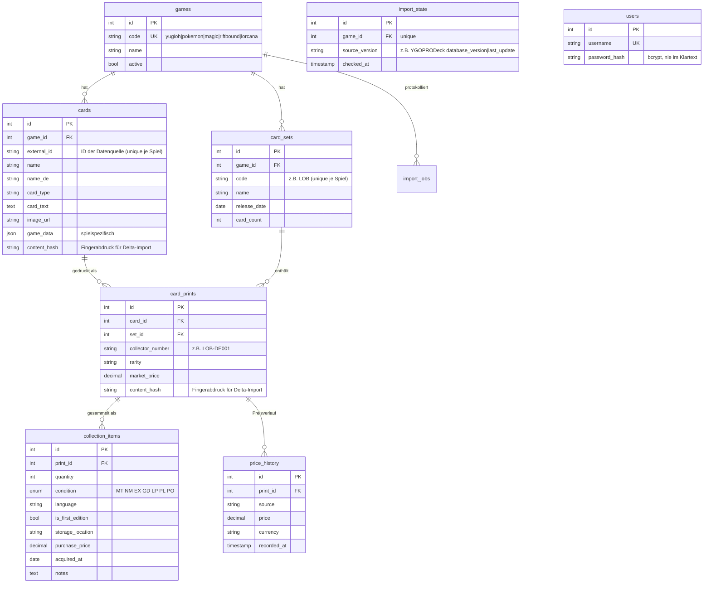

# Datenbank

MariaDB-Schema `tcg_collection`, verwaltet über **Knex-Migrationen** (`backend/migrations/`).
Niemals Tabellen von Hand ändern — immer eine neue Migration anlegen (`npx knex migrate:make <name>`).

## Multi-TCG-Grundidee

Das Schema trennt drei Ebenen, die für **alle** Sammelkartenspiele identisch funktionieren:

1. **Karte** (`cards`) — die logische Karte („Blauäugiger w. Drache"), unabhängig davon, wo sie gedruckt wurde.
2. **Print** (`card_prints`) — ein konkreter Druck dieser Karte in einem Set mit Set-Nummer und Seltenheit („LOB-DE001, Ultra Rare"). Eine Karte hat oft viele Prints.
3. **Sammlungseintrag** (`collection_items`) — physisch besessene Exemplare eines Prints mit Menge, Zustand, Sprache, 1. Auflage, Lagerort, Kaufpreis.

Gesammelt wird also immer ein **Print**, nicht die abstrakte Karte — genau wie bei cardcluster.

Spielspezifische Attribute (ATK/DEF, Level, Attribut bei Yu-Gi-Oh!; später Manakosten bei Magic, Ink bei Lorcana, …) liegen als JSON in `cards.game_data`. Dadurch braucht ein neues Spiel **keine Schemaänderung**, nur einen neuen Importer.

## ER-Diagramm



`users` steht bewusst **ohne Beziehung** zu den anderen Tabellen — die Sammlung ist (noch) nicht pro Nutzer getrennt, der Login schützt aktuell nur den Zugriff auf die App als Ganzes (relevant, sobald sie außerhalb des LAN erreichbar ist). Accounts werden nicht über die API angelegt, sondern per CLI (`npm run user:create -- <username> <passwort>`, siehe [docs/DEPLOYMENT-SYNOLOGY.md](DEPLOYMENT-SYNOLOGY.md)).

## Delta-Import (`content_hash`, `import_state`)

Ein erneuter Katalog-Import lädt nicht bei jedem Lauf alles neu:

1. **Versions-Kurzschluss**: Vor dem eigentlichen Abgleich wird die aktuelle Version der Quelle abgefragt (bei YGOPRODeck über `checkDBVer.php`) und mit dem zuletzt gesehenen Wert in `import_state.source_version` verglichen. Ist sie identisch, bricht der Import sofort ab — keine weitere API-Anfrage, kein DB-Schreibzugriff.
2. **Inhalts-Vergleich**: Hat sich die Quellversion geändert (oder beim allerersten Import), wird trotzdem nur geschrieben, was sich wirklich geändert hat: Für jede Karte/jeden Print wird ein MD5-Fingerabdruck der relevanten Felder berechnet und mit dem in `cards.content_hash`/`card_prints.content_hash` gespeicherten Wert verglichen. Nur bei Abweichung (neuer oder geänderter Datensatz) erfolgt ein Schreibzugriff.

Das hält sowohl die Anzahl der API-Aufrufe als auch die Zahl der DB-Schreibvorgänge bei unveränderten Daten minimal — wichtig für regelmäßige automatische Läufe (siehe `npm run import:delta` bzw. [docs/DEPLOYMENT-SYNOLOGY.md](DEPLOYMENT-SYNOLOGY.md)).

Ein neuer Importer für ein weiteres Spiel sollte dasselbe Prinzip übernehmen, muss es aber nicht zwingend — `ImportOptions.force` und die `skipped`/`*Changed`-Felder in `ImportStats` sind Teil des `GameImporter`-Interfaces und werden von Routen/Scripts bereits generisch unterstützt.

## Inhalt von `cards.game_data` bei Yu-Gi-Oh!

Vom YGOPRODeck-Importer befüllt, z. B.:

```json
{
  "frameType": "effect",
  "race": "Dragon",
  "attribute": "LIGHT",
  "level": 8,
  "atk": 3000,
  "def": 2500,
  "archetype": "Blue-Eyes",
  "linkval": null,
  "scale": null
}
```

Für spätere Spiele analog (Magic: `{ "manaCost": "{2}{U}", "colors": ["U"], ... }`).

## Deutsche Lokalisierung (`name_de`, `card_text_de`)

Der Importer lädt zusätzlich zum englischen Katalog den deutschen Katalog von YGOPRODeck (`cardinfo.php?language=de`) und befüllt `name_de`/`card_text_de`. Nicht jede Karte hat eine deutsche TCG-Ausgabe (Stand des ersten Imports: 11.769 von 14.472 Karten) — in dem Fall bleiben beide Felder `null`. Das Frontend zeigt automatisch `name_de || name` bzw. `card_text_de || card_text` an, es ist also keine gesonderte Sprachumschaltung nötig.

## Zustands-Skala (`collection_items.condition`)

Cardmarket-Standard: `MT` Mint · `NM` Near Mint · `EX` Excellent · `GD` Good · `LP` Light Played · `PL` Played · `PO` Poor.

## Einrichtung der Datenbank auf der Synology

Einmalig in phpMyAdmin oder per CLI als root:

```sql
CREATE DATABASE tcg_collection CHARACTER SET utf8mb4 COLLATE utf8mb4_unicode_ci;
CREATE USER 'tcg'@'%' IDENTIFIED BY '<sicheres-passwort>';
GRANT ALL PRIVILEGES ON tcg_collection.* TO 'tcg'@'%';
FLUSH PRIVILEGES;
```

Danach Zugangsdaten in `.env` eintragen und Migration ausführen:

```bash
cd backend && npm run migrate
```

Die Migration legt alle Tabellen an und trägt die fünf Spiele in `games` ein (nur `yugioh` aktiv).
